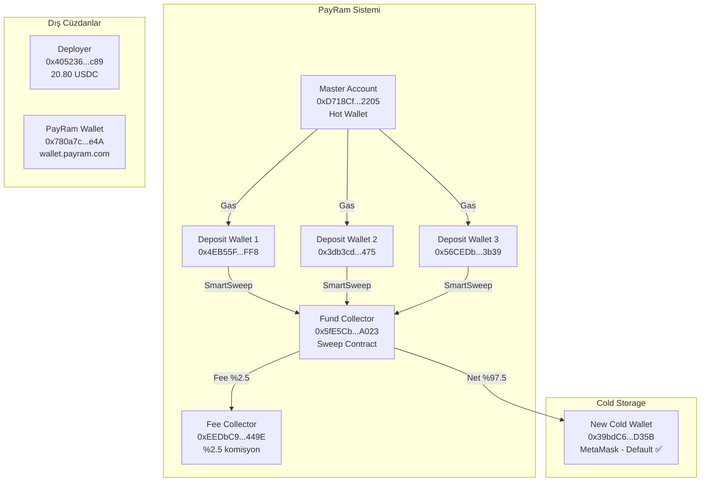
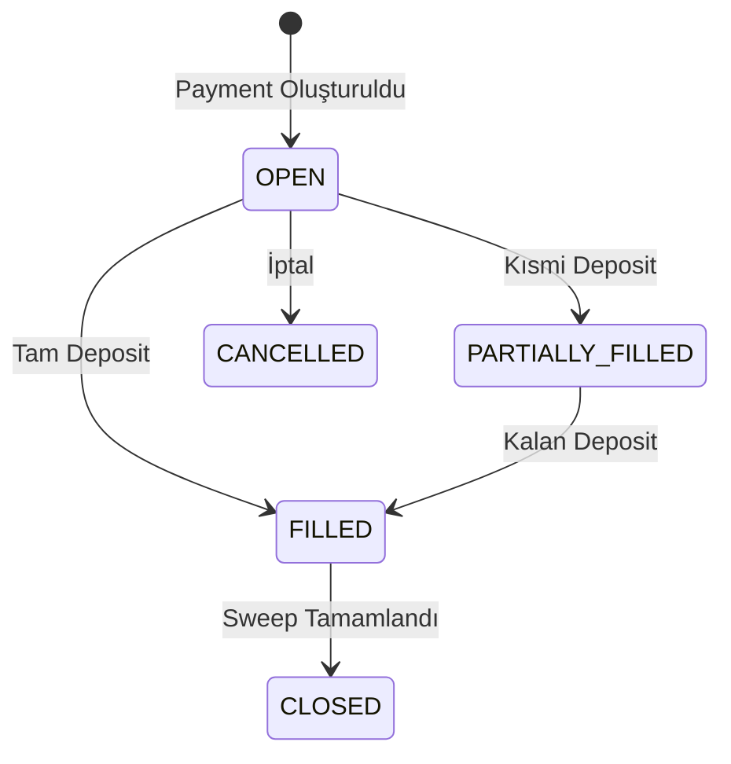
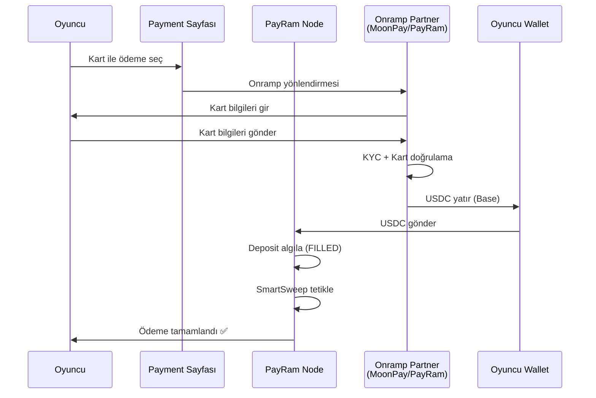

# PayRam Self-Hosted Payment Gateway — Kurulum & Entegrasyon Dokümantasyonu

> **Tarih:** 2026-06-16  
> **Versiyon:** v3.1.3  
> **Ortam:** Base Sepolia Testnet  
> **Son Güncellenme:** 2026-06-16

---

## 1. Proje Özeti

### 1.1 Hedef
iGaming/sportsbook platformu için card-to-crypto onramp entegrasyonu. Oyuncular kredi kartı ile USDC satın alıp doğrudan oyun platformuna yatırım yapabilmeli.

### 1.2 Seçilen Mimari
**Varyant C: PayRam-Native** — Self-hosted PayRam node ile tam entegrasyon.

### 1.3 Sistem Gereksinimleri
| Bileşen | Detay |
|---------|-------|
| **VPS** | AWS EC2 m7i-flex.large, Ubuntu 26.04 |
| **Elastic IP** | `52.68.37.77` |
| **PayRam** | v3.1.3 (2026-06-15 güncellendi) |
| **Database** | PostgreSQL 17 (container içinde) |
| **Ağ** | Base Sepolia (Chain ID: 84532) |
| **USDC Contract** | `0x036CbD53842c5426634e7929541eC2318f3dCF7e` (decimals: 6) |

---

## 2. Wallet Hiyerarşisi & Bakiyeler

### 2.1 Wallet Haritası



### 2.2 Güncel Bakiyeler (On-Chain Verified ✅)

| Wallet | Adres | ETH | USDC | Durum |
|--------|-------|:---:|:----:|-------|
| **Master Account** | `0xD718Cf6e3c7E5e7490c00742872e4be7139c2205` | 0.19 | 0 | Gas için |
| **New Cold Wallet** | `0x39bdC622aFb24b767457270D4564C50c8a50D35B` | 0.10 | **29.50** | Default ✅ |
| **Old Cold Wallet** | `0xf9FcC6333f74f0fC3179B7540BfFFbBb9ca390D5` | 0 | 0 | Boşaltıldı |
| **Fee Collector** | `0xEEDbC938A8Fb909AbaADdA77559bbE6E660c449E` | 0 | 0 | — |
| **Fund Collector** | `0x5fE5CbADDaE2377Ba281419Ce39357beB79DA023` | 0 | 0 | Sweep contract |
| **Deployer** | `0x405236Bc33C454232a62B45D6145eEF337966C89` | 0.05 | 20.80 | SCW deployer |
| **PayRam Wallet** | `0x780a7cB68656A891888AAc0B0bCE3De2A3837e4A` | 0 | 0 | wallet.payram.com |

---

## 3. API Entegrasyonu

### 3.1 Temel Bilgiler

| Parametre | Değer |
|-----------|-------|
| **Base URL** | `http://52.68.37.77` |
| **API Key** | `2f31ed780b37c0fcfbde48a0764aa5b8` |
| **Header Adı** | `API-Key` (v3.1.3'de değişti!) |
| **Content-Type** | `application/json` |

> ⚠️ **Önemli:** v3.0.5'te header `x-api-key` idi. v3.1.3'te `API-Key` olarak değişti.

### 3.2 API Endpoint'leri

#### 3.2.1 Payment Oluşturma
```http
POST /api/v1/payment
Headers:
  API-Key: <your_api_key>
  Content-Type: application/json

Body:
{
  "customerEmail": "oyuncu@example.com",
  "customerID": "oyuncu-123",
  "amountInUSD": 50
}

Response:
{
  "host": "http://52.68.37.77",
  "reference_id": "c80f5363-0397-4761-aa1a-3155c3a21470",
  "url": "http://52.68.37.77/payments?reference_id=c80f5363-..."
}
```

#### 3.2.2 Deposit Address Atama
```http
POST /api/v1/deposit-address/reference/{reference_id}
Headers:
  API-Key: <your_api_key>
  Content-Type: application/json

Body:
{
  "blockchain_code": "BASE"
}

Response:
{
  "depositAddress": "0x4EB55F...FF8"
}
```

#### 3.2.3 Payment Durumu Sorgulama
```http
GET /api/v1/payment/reference/{reference_id}
Headers:
  API-Key: <your_api_key>

Response:
{
  "invoiceID": "...",
  "customerID": "...",
  "amountInUSD": "50",
  "filledAmount": "50",
  "filledAmountInUSD": "50",
  "paymentState": "FILLED",
  "confirmationCurrent": 30,
  "confirmationRequired": 30,
  "depositAddress": "0x...",
  "referenceID": "..."
}
```

### 3.3 Payment Durum Akışı



---

## 4. Card Onramp Entegrasyonu

### 4.1 Onramp Durumu

Self-hosted PayRam node'da **Cards onramp zaten aktif** ve çalışıyor:

| Özellik | Durum |
|---------|-------|
| **Channel Type** | Onramp |
| **Status** | Active ✅ |
| **Coin** | USDC |
| **Network** | Base |
| **Geography** | Global |
| **Confirmation Time** | Instant |

### 4.2 Payment Sayfası Ödeme Seçenekleri

Payment sayfasında (`http://52.68.37.77/payments?reference_id=...`) görünen seçenekler:

| # | Seçenek | Açıklama | Partnerler |
|---|---------|----------|------------|
| 1 | **Pay with crypto** | Doğrudan USDC gönderimi | Bitcoin, ETH, Base, USDC |
| 2 | **Cards, Wallets, Banks & local methods** | Kart/cüzdan/yerel ödeme | Apple Pay, Google Pay, PayPal, Revolut, UPI, Pix, SEPA, Mastercard, MetaMask, Binance |
| 3 | **Card & wallets** | Sadece kart ve dijital cüzdanlar | Apple Pay, Google Pay, kart |
| 4 | **Buy on an exchange** | Borsadan satın alıp gönderme | Binance, Coinbase, MetaMask, PayPal, Revolut |

### 4.3 Onramp Akışı



### 4.4 wallet.payram.com Farkı

| Özellik | Self-Hosted Node | wallet.payram.com |
|---------|------------------|-------------------|
| **URL** | `http://52.68.37.77` | `wallet.payram.com` |
| **Kontrol** | Tamamen sizin kontrolünüzde | PayRam'ın kendi service'i |
| **Onramp** | Aktif ve çalışıyor ❌ | MoonPay widget yüklenmiyor |
| **Cüzdan** | Sizin cüzdanlarınız | PayRam'ın hosted cüzdanı |
| **Amaç** | Merchant payment gateway | Müşteri cüzdanı |

> **Sonuç:** `wallet.payram.com`'daki MoonPay sorunu önemli değil. Self-hosted node'da onramp zaten çalışıyor.

---

## 5. Test Sonuçları

### 5.1 Tamamlanan Testler

| Test | Tutar | Durum | Sweep Net | TX |
|:----:|:-----:|:-----:|:---------:|----|
| 1 | $12 | ✅ CLOSED | 11.70 USDC | `0x0db62d14...d24778` |
| 2 | $8 | ✅ CLOSED | 7.80 USDC | `0x49808081...fbf6ab` |
| 3 | $10 | ✅ FILLED | 9.75 USDC | `0x809d2bf4...fb03b` |

### 5.2 Fee Analizi

| Test | Brüt | Fee %2.5 | Net |
|:----:|:----:|:--------:|:---:|
| 1 | 12.00 | 0.30 | 11.70 |
| 2 | 8.00 | 0.20 | 7.80 |
| 3 | 10.00 | 0.25 | 9.75 |
| **Toplam** | **30.00** | **0.75** | **29.25** |

**Formül:**
```
net = brüt × 0.975
fee = brüt × 0.025
```

---

## 6. Docker & Container Yönetimi

### 6.1 Container Bilgileri

| Parametre | Değer |
|-----------|-------|
| **Container Adı** | payram |
| **Image** | payramapp/payram:3.1.3 |
| **Port** | 80 (host) → 80 (container) |
| **Restart Policy** | unless-stopped |

### 6.2 Volume Mounts

| Host Path | Container Path | Amaç |
|-----------|----------------|------|
| `/home/ubuntu/.payram-core/db/postgres` | `/var/lib/payram/db/postgres` | PostgreSQL verisi |
| `/home/ubuntu/.payram-core/log/supervisord` | `/var/log` | Log'lar |
| `/etc/letsencrypt` | `/etc/letsencrypt` | SSL sertifikaları (read-only) |
| `/home/ubuntu/.payram-core` | `/root/payram` | PayRam konfigürasyonu |

### 6.3 Güncelleme (v3.0.5 → v3.1.3)

```bash
# 1. Yeni image'ı çek
docker pull payramapp/payram:3.1.3

# 2. Eski container'ı durdur ve yeniden adlandır
docker stop payram && docker rename payram payram-old

# 3. Yeni container'ı başlat (aynı volumes ve env ile)
docker run -d --name payram --restart unless-stopped \
  -p 80:80 \
  -v /home/ubuntu/.payram-core/db/postgres:/var/lib/payram/db/postgres \
  -v /home/ubuntu/.payram-core/log/supervisord:/var/log \
  -v /etc/letsencrypt:/etc/letsencrypt:ro \
  -v /home/ubuntu/.payram-core:/root/payram \
  -e AES_KEY=cb1b6c14566fd3d6704b0b41e8c6fe80df8ee2226f40f4d9484723d458694632 \
  -e SERVER=DEVELOPMENT \
  -e POSTGRES_SSLMODE=prefer \
  -e POSTGRES_PORT=5432 \
  -e POSTGRES_DATABASE=payram \
  -e POSTGRES_USERNAME=payram \
  -e POSTGRES_PASSWORD=payram123 \
  -e PAYMENTS_APP_SERVER_URL=https://x.payram.com \
  -e BLOCKCHAIN_NETWORK_TYPE=testnet \
  -e POSTGRES_HOST=localhost \
  -e SSL_CERT_PATH= \
  payramapp/payram:3.1.3
```

### 6.4 Yararlı Komutlar

```bash
# Container durumunu kontrol et
docker ps --format '{{.Names}}:{{.Image}}:{{.Status}}'

# Log'ları izle
docker logs payram --tail 50 -f

# Database'e bağlan
docker exec payram psql -U payram -d payram

# Tabloları listele
docker exec payram psql -U payram -d payram -c '\dt'

# API key'leri listele
docker exec payram psql -U payram -d payram -c 'SELECT id, key, status FROM api_keys;'

# Payment channels'ı kontrol et
docker exec payram psql -U payram -d payram -c 'SELECT id, name, channel_type, status FROM payment_channels;'

# Configurations'ı listele
docker exec payram psql -U payram -d payram -c 'SELECT id, config_key, config_value FROM configurations ORDER BY id;'
```

---

## 7. Database Şeması

### 7.1 Önemli Tablolar

| Tablo | Amaç |
|-------|------|
| `api_keys` | API anahtarları |
| `payment_requests` | Oluşturulan ödemeler |
| `deposits` | Algılanan deposit'ler |
| `sweep_transactions` | Sweep işlemleri |
| `wallet_scws` | Smart Contract Wallet'lar |
| `blockchains` | Blockchain ağları |
| `payment_channels` | Ödeme kanalları (Crypto, Cards) |
| `configurations` | Sistem konfigürasyonları |

### 7.2 Payment Channels

| ID | Name | Type | Status | DisplayName |
|----|------|------|--------|-------------|
| 1 | payram_crypto | blockchain | active | Crypto |
| 2 | payments_app | app | active | Cards |

### 7.3 Blockchains

| ID | Name | Status | Chain ID |
|----|------|--------|----------|
| 1 | Ethereum | active | 1 |
| 2 | Bitcoin | active | — |
| 3 | Tron | active | — |
| 4 | Base | active | 84532 |
| 5 | Polygon | active | 137 |

---

## 8. Bilinen Sorunlar & Çözümler

### 8.1 API Header Değişikliği
- **Sorun:** v3.0.5'te `x-api-key` ile çalışan API, v3.1.3'te `UNAUTHORIZED` hatası veriyor
- **Çözüm:** Header adı `API-Key` olarak değişti (capital letters)

### 8.2 MetaMask USDC Symbol
- **Sorun:** MetaMask'ta USDC token'ı symbol göstermiyor
- **Çözüm:** Basescan Write Contract ile transfer yapılıyor

### 8.3 wallet.payram.com MoonPay
- **Sorun:** wallet.payram.com'daki MoonPay widget yüklenmiyor
- **Durum:** Bu PayRam'ın kendi hosted service'i, self-hosted node ile ilgili değil
- **Çözüm:** Self-hosted node'daki Cards onramp zaten çalışıyor

### 8.4 Eski Cold Wallet Private Key
- **Sorun:** `0xf9FcC6...390D5` adresinin private key'i kayıp
- **Durum:** EIP-7702 delegasyonu ile boşaltıldı, şu an 0 USDC
- **Etki:** Yok (tüm fonlar yeni cold wallet'a aktarıldı)

### 8.5 Redis Server FATAL
- **Sorun:** redis-server container FATAL durumda
- **Etki:** Testnet için önemli değil, production'da çözülmeli

### 8.6 Sweep Fee Belirsizliği (2026-06-16 Toplantı)
- **PayRam'iddia:** %2.5 fee onlara ait
- **Bizim gözlemimiz:** MetaMask blockchain explorer'da farklı görünüyor
- **Durum:** Testnet'te exclusion olabilir, mainnet'te alınıyor olabilir
- **Çözüm:** Mainnet'te küçük bir test ($10-20) yapılarak gerçek fee ölçülmeli

---

## 9. Production'a Geçiş Kontrol Listesi

### 9.1 Mainnet Geçişi
- [ ] `BLOCKCHAIN_NETWORK_TYPE=mainnet` olarak değiştir
- [ ] Mainnet USDC contract'ını yapılandır: `0x833589fCD6eDb6E08f4c7C32D4f71b54bdA02913`
- [ ] Mainnet Base RPC: `https://mainnet.base.org`
- [ ] SSL sertifikası kur (Let's Encrypt)
- [ ] Domain adı yapılandır

### 9.2 Güvenlik
- [ ] Firewall yapılandırması (sadece 80/443 açık)
- [ ] SSH key-based authentication
- [ ] API key rotation stratejisi
- [ ] Rate limiting
- [ ] IP whitelist (gerekirse)

### 9.3 Monitoring
- [ ] Container health checks
- [ ] Disk usage monitoring
- [ ] Transaction monitoring
- [ ] Alert sistemi (email/Telegram)

### 9.4 Backup
- [ ] Database backup stratejisi
- [ ] Wallet key backup (güvenli yer)
- [ ] Configuration backup

---

## 10. Deployment Scriptleri

### 10.1 Payment Oluşturma (PowerShell)

```powershell
# create_new_payment.ps1
$headers = @{
    "Content-Type" = "application/json"
    "API-Key" = "2f31ed780b37c0fcfbde48a0764aa5b8"
}

$body = @{
    customerEmail = "oyuncu@example.com"
    customerID = "oyuncu-123"
    amountInUSD = 50
} | ConvertTo-Json

$response = Invoke-WebRequest -Uri "http://52.68.37.77/api/v1/payment" `
    -Method POST `
    -Headers $headers `
    -Body $body

$response.Content | ConvertFrom-Json
```

### 10.2 Payment Durumu Sorgulama

```powershell
$headers = @{
    "API-Key" = "2f31ed780b37c0fcfbde48a0764aa5b8"
}

$referenceId = "c80f5363-0397-4761-aa1a-3155c3a21470"

$response = Invoke-WebRequest -Uri "http://52.68.37.77/api/v1/payment/reference/$referenceId" `
    -Method GET `
    -Headers $headers

$response.Content | ConvertFrom-Json
```

---

## 11. Ek Kaynaklar

| Kaynak | URL |
|--------|-----|
| PayRam Docs | https://docs.payram.com |
| PayRam GitHub | https://github.com/PayRam/payram-core |
| Base Sepolia Faucet | https://faucet.circle.com |
| BaseScan Testnet | https://sepolia.basescan.org |
| MoonPay Docs | https://dev.moonpay.com |

---

## 12. İletişim

| Rol | E-posta |
|-----|---------|
| Merchant | info@trdefi.com |
| PayRam Support | support@payram.com |

---

**Son Güncelleme:** 2026-06-16  
**Durum:** ✅ Testnet ortamı aktif, onramp çalışıyor, production'a hazır
