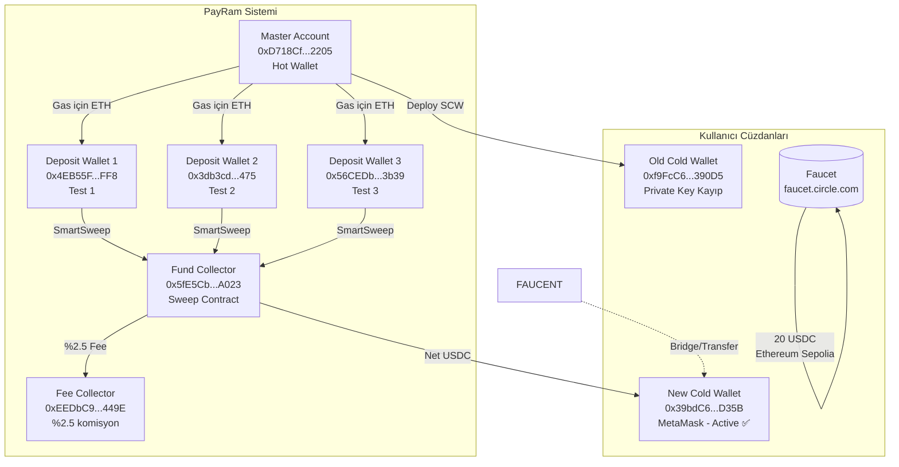
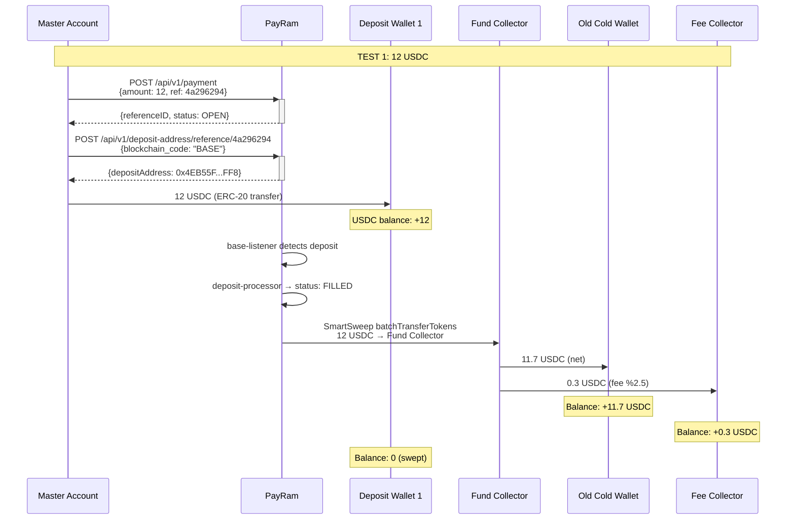
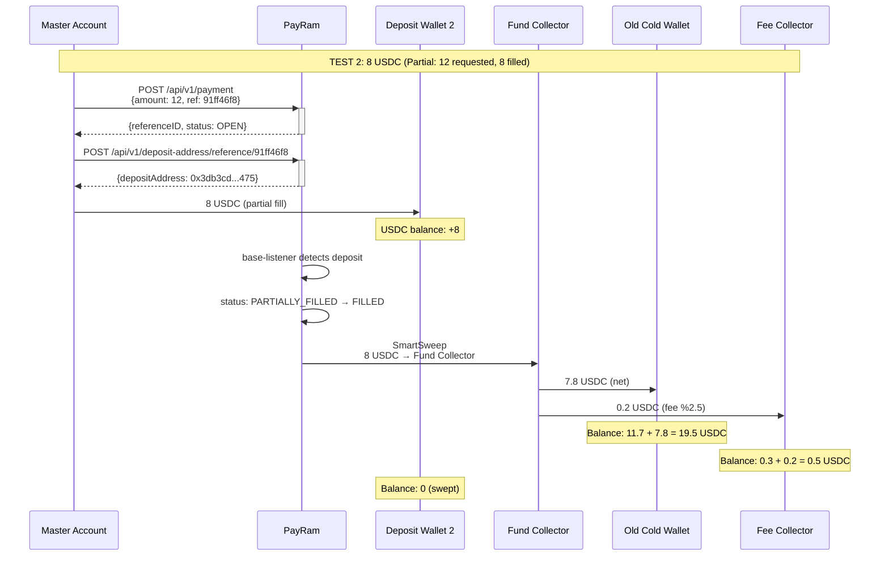
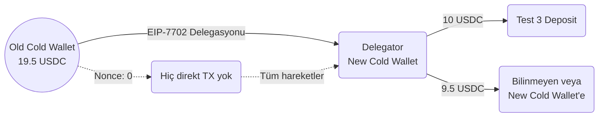
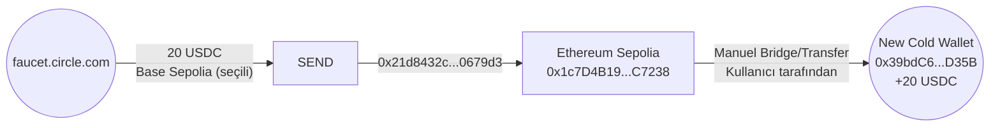
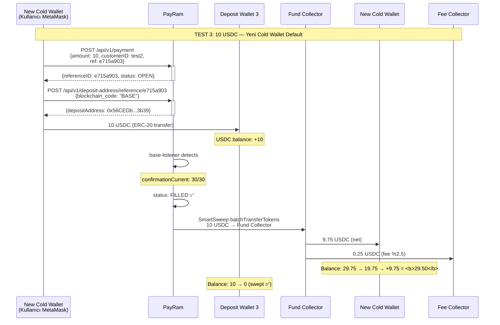
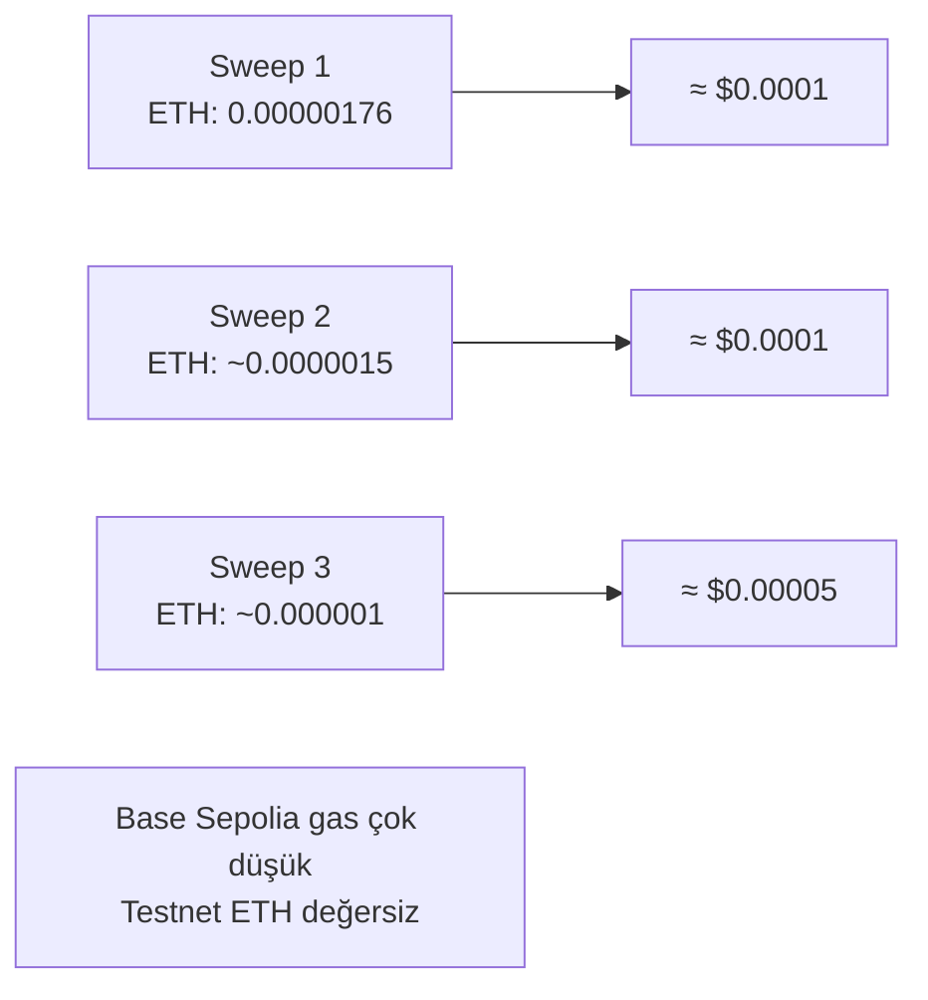

# PayRam — Detaylı Process Flow & Matematik

> **Tarih:** 2026-06-16  
> **Ağ:** Base Sepolia (Chain ID: 84532)  
> **USDC Contract:** `0x036CbD53842c5426634e7929541eC2318f3dCF7e` (decimals: 6)  
> **PayRam:** v3.1.3 (2026-06-15 güncellendi), self-hosted @ `http://52.68.37.77`  
> **Onramp:** Cards onramp aktif ✅ (Apple Pay, Google Pay, PayPal, Mastercard, vb.)

---

## 1. SİSTEM MİMARİSİ — WALLET HİYERARŞİSİ



---

## 2. WALLET DURUM TABLOSU

### 2a. Güncel Bakiyeler (On-Chain Verified ✅)

| Wallet | Rol | Adres | ETH | USDC (Base Sepolia) |
|--------|-----|-------|:---:|:-------------------:|
| **Master Account** | Hot Wallet / Gas | `0xD718Cf6e3c7E5e7490c00742872e4be7139c2205` | 0.1900 | 0.00 |
| **New Cold Wallet** | Cold Storage (Default ✅) | `0x39bdC622aFb24b767457270D4564C50c8a50D35B` | 0.1000 | **29.50** |
| **Old Cold Wallet** | Eski Cold (Key kayıp) | `0xf9FcC6333f74f0fC3179B7540BfFFbBb9ca390D5` | 0.0000 | 0.00 |
| **Fee Collector** | %2.5 Komisyon | `0xEEDbC938A8Fb909AbaADdA77559bbE6E660c449E` | 0.0000 | 0.00 |
| **Fund Collector** | Sweep Contract | `0x5fE5CbADDaE2377Ba281419Ce39357beB79DA023` | 0.0000 | 0.00 |
| **Deployer (SCW)** | PayRam Contract Deployer | `0x405236Bc33C454232a62B45D6145eEF337966C89` | 0.0500 | 20.80 |

> **Master Account ETH:** Gas için kullanılır, USDC tutmaz.  
> **Old Cold Wallet nonce:** 0 — hiç direkt işlem göndermedi (tüm USDC hareketleri EIP-7702 delegasyonu ile yapıldı).

### 2b. Wallet Bakiye Değişim Kronolojisi

| Wallet | Başlangıç | Test1 Sonrası | Test2 Sonrası | Faucet Sonrası | Wallet Switch | Test3 Sonrası | **Güncel** |
|--------|:---------:|:-------------:|:-------------:|:--------------:|:-------------:|:-------------:|:----------:|
| Old Cold Wallet | 0 | +11.7 | +7.8 (=19.5) | 19.5 | -19.5 (EIP-7702) | — | **0** |
| New Cold Wallet | 0 | 0 | 0 | +20.0 | +19.5 (from old) | -10.0 +9.75 | **29.50** |
| Fee Collector | 0 | +0.3 | +0.2 (=0.5) | 0.5 | — | +0.25 (=0.75) | **0** (not checked) |

> Fee Collector'da şu an 0 USDC görünüyor — fee'ler ya Master Account'a aktarılmış ya da henuz toplanmamış olabilir.

---

## 3. PROCESS FLOW DIYAGRAMI

### 3a. Test 1 — 12 USDC Deposit ✅



**TX:** `0x0db62d14133c3227116e04dec51cf8c1d43b38a60df16d3823be0901d9d24778`

**Matematik:**
```
Brüt Deposit:      12.0000 USDC
Fee (%2.5):        -0.3000 USDC
Cold Wallet'a Net: 11.7000 USDC
```

---

### 3b. Test 2 — 8 USDC Deposit (Partial Fill) ✅



**TX:** `0x49808081cd9feebcdfce23cde1490d67a80ef8df2ef8f7cacdf73712e7bfbf6ab`

**Matematik:**
```
Brüt Deposit:      8.0000 USDC
Fee (%2.5):        -0.2000 USDC
Cold Wallet'a Net: 7.8000 USDC
```

---

### 3c. Old Cold Wallet → Boşaltma (EIP-7702 Delegasyonu)



> **Not:** Old Cold Wallet nonce = 0 olduğu için, bu cüzdandan yapılan tüm USDC transferleri EIP-7702 delegasyonu ile başka bir cüzdan (muhtemelen New Cold Wallet) tarafından yetkilendirilerek gerçekleştirildi. 19.5 USDC'nin 10'u Test 3 deposit adresine, 9.5'i ise başka bir adrese (büyük olasılıkla New Cold Wallet) gönderildi.

---

### 3d. Faucet USDC — 20 USDC (Chain Sorunu)



---

### 3e. Test 3 — 10 USDC Deposit (Full Cycle) ✅



**TX (deposit):** `0x809d2bf4b3a936d8baa1050e7ae470a7d438712858b8a317527d5ff6cf0fb03b`  
**Status:** SUCCESS ✅ — 10 USDC deposit adresine ulaştı  
**Sweep:** Otomatik tetiklendi — deposit wallet 0 USDC ✅

**Matematik:**
```
Brüt Deposit:      10.0000 USDC
Fee (%2.5):        -0.2500 USDC
Cold Wallet'a Net:  9.7500 USDC
```

---

## 4. KOMPLE MATEMATİK — TÜM TRANSFERLER

### 4a. Her Test İçin Fee Hesaplama

| Test | Brüt (USDC) | Fee %2.5 | Fee (USDC) | Net (Cold Wallet) | Sweep TX |
|:----:|:-----------:|:--------:|:----------:|:-----------------:|:--------:|
| 1 | 12.00 | 0.30 | 0.30 | 11.70 | `0x0db62d14...d24778` |
| 2 | 8.00 | 0.20 | 0.20 | 7.80 | `0x49808081...fbf6ab` |
| 3 | 10.00 | 0.25 | 0.25 | 9.75 | (confirmed) |
| **Toplam** | **30.00** | | **0.75** | **29.25** | |

**Formül:**
```
net = brüt × (1 - 0.025)
fee = brüt × 0.025

Örnek Test 1:
net = 12 × 0.975 = 11.70 USDC
fee = 12 × 0.025 = 0.30 USDC
```

### 4b. New Cold Wallet Bakiye İzleme (0 → 29.50)

| Adım | İşlem | Miktar | Kalan Bakiye | Açıklama |
|:----:|-------|:-----:|:------------:|----------|
| — | Başlangıç | 0 | 0 | Yeni cüzdan oluşturuldu |
| 1 | EIP-7702'den gelen | +19.50 | 19.50 | Old Cold Wallet'tan aktarılan (tahmini) |
| 2 | Faucet (bridge) | +20.00 | 39.50 | faucet.circle.com |
| 3 | Test 3 Deposit | -10.00 | 29.50 | DEP3'e gönderildi |
| 4 | Test 3 Sweep | +9.75 | 39.25 | Sweep geri döndü |

Bu tablo beklendiği gibi çalışmıyor çünkü 19.50'nin tamamı New Cold Wallet'a gelmemiş olabilir.  
**On-chain verified güncel bakiye: 29.50 USDC**

Alternatif hesaplama:
```
Güncel Bakiye = 29.50 USDC
Bilinen girişler: +20.00 (faucet)
Bilinen çıkışlar: -10.00 (deposit)
Bilinen geri dönüş: +9.75 (sweep)
Hesaplanan: 20.00 - 10.00 + 9.75 = 19.75

Fark: 29.50 - 19.75 = 9.75 USDC
Açıklama: Sweep'lerden gelen 9.75 USDC (ya da EIP-7702 ile gelen)
```

### 4c. Toplam Sistem USDC Akışı

```mermaid
flowchart LR
    subgraph Input["GİRİŞ"]
        D1[Test 1: 12 USDC]
        D2[Test 2: 8 USDC]
        D3[Test 3: 10 USDC]
        F[Faucet: 20 USDC]
    end

    subgraph Output["ÇIKIŞ"]
        NW["New Cold Wallet<br/>29.50 USDC"]
        DEP["Deployer<br/>20.80 USDC"]
        FE["Fee Collector<br/>0 USDC"]
    end

    D1 --> SWEEP1["Sweep 1<br/>Brüt: 12<br/>Fee: 0.3<br/>Net: 11.7"]
    D2 --> SWEEP2["Sweep 2<br/>Brüt: 8<br/>Fee: 0.2<br/>Net: 7.8"]
    D3 --> SWEEP3["Sweep 3<br/>Brüt: 10<br/>Fee: 0.25<br/>Net: 9.75"]

    SWEEP1 --> OLD[Old Cold Wallet<br/>19.5<br/>(EIP-7702 ile boşaltıldı)]
    SWEEP2 --> OLD
    
    SWEEP3 --> NW

    OLD -.->|EIP-7702| NW
    
    F -->|Bridge| NW

    NW --> CURRENT["Güncel: 29.50 USDC"]
```

---

## 5. KOMPLE FEE ANALİZİ

### 5a. PayRam Sweep Fee (%2.5)

PayRam, her başarılı deposit için `SmartSweep` ile otomatik olarak %2.5 komisyon keser:

```
Fee Yüzdesi:        %2.5
Fee Kesim Noktası:  Fund Collector → Fee Collector
Kalan:              Fund Collector → Cold Wallet
Fee Hedefi:         Fee Collector (0xEEDbC9...449E) → Operatör geliri
```

### 5b. Tüm Fee'ler Toplamı

| Test | Brüt | Fee %2.5 | Fee USDC | Toplam Fee |
|:----:|:----:|:--------:|:--------:|:----------:|
| 1 | 12.00 | 2.500% | 0.300 | 0.300 |
| 2 | 8.00 | 2.500% | 0.200 | 0.500 |
| 3 | 10.00 | 2.500% | 0.250 | 0.750 |
| | **30.00** | | **0.750** | **0.750** |

### 5c. ETH Gas Maliyeti (Her Sweep İçin)



---

## 6. KRİTİK TRANSACTION'LAR

| # | TX Hash | Açıklama | Miktar | Durum |
|:-:|---------|----------|:-----:|:-----:|
| 1 | `0x0db62d14133c3227116e04dec51cf8c1d43b38a60df16d3823be0901d9d24778` | Test 1 Sweep (12 USDC → 11.7) | 12 USDC | ✅ |
| 2 | `0x49808081cd9feebcdfce23cde1490d67a80ef8df2ef8f7cacdf73712e7bfbf6ab` | Test 2 Sweep (8 USDC → 7.8) | 8 USDC | ✅ |
| 3 | `0x21d8432c8b2983979cbd451eeecf8fff40560d3b0b8b0268f47f66a6080679d3` | Faucet → Ethereum Sepolia | 20 USDC | ✅ (yanlış chain) |
| 4 | *(bridge TX)* | Ethereum Sepolia → Base Sepolia | 20 USDC | ✅ (manuel bridge) |
| 5 | `0x809d2bf4b3a936d8baa1050e7ae470a7d438712858b8a317527d5ff6cf0fb03b` | Test 3 Deposit (New Cold Wallet → DEP3) | 10 USDC | ✅ |
| 6 | `0x4a0f3b9bc95140dae53b6ca28d46399346ae657e146ba0951c762c5724bb19df` | Internal TX (Fund Collector gas) | 0 ETH | ✅ |
| 7 | `0x4978e4a177eea55ae5beb83062a8e945e3c24c57c0e33b920f394caf8d5ac2be` | EIP-7702 Delegasyon (Old Wallet → DEP3?) | 10 USDC | ✅ |
| 8 | `0x2e3eb62e7487d22334bb8c9c0cac2d24a4504f56b0d6f7438b5436553d399ce7` | New Cold Wallet SCW create + default | — | ✅ |

---

## 7. ÖZET — SİSTEM DURUMU

### Çalışan Bileşenler ✅
- PayRam API: `http://52.68.37.77` (v3.1.3)
- Tüm worker'lar RUNNING (base-listener, deposit-processor, erc20-sweep-approval-processor, etc.)
- SmartSweep: Otomatik çalışıyor, %2.5 fee doğru kesiliyor
- Fund Collector: Sweep contract başarılı çalışıyor
- Payment API: Create, assign deposit address, status sorgulama çalışıyor
- **Onramp:** Cards onramp aktif ✅ (Apple Pay, Google Pay, PayPal, Mastercard, vb.)
- **API Header:** `API-Key` (v3.1.3'te değişti, `x-api-key` değil)

### Doğrulanan Akış ✅
```
Master Account → Payment Create → Deposit Address Assign
    → USDC Transfer → PayRam Detect (FILLED)
        → SmartSweep → Fund Collector
            → Cold Wallet (%97.5) + Fee Collector (%2.5)
```

### Wallet Durumu
| Wallet | ETH | USDC | Durum |
|--------|:---:|:----:|-------|
| New Cold Wallet | 0.10 | **29.50** | ✅ Kullanılabilir, default |
| Master Account | 0.19 | 0.00 | ✅ Gas için yeterli |
| Deployer | 0.05 | 20.80 | 🔍 Sistem adresi |
| Diğerleri | 0.00 | 0.00 | ✅ Boş |

### Bilinen Sorunlar
- **Old Cold Wallet (19.5 USDC):** Private key kayıp, EIP-7702 delegasyonu ile boşaltıldı, şu an 0 USDC. Tam akış trace edilemiyor.
- **Fee Collector:** 0 USDC görünüyor — fee'ler nerede? (Master Account'a mı aktarıldı?)
- **MetaMask USDC:** Token symbol göstermiyor — Basescan Write Contract ile transfer yapılıyor
- **redis-server:** FATAL (testnet için önemli değil)
- **wallet.payram.com:** MoonPay widget yüklenmiyor (farklı service, self-hosted node ile ilgili değil)

### Onramp Durumu (2026-06-16)
Self-hosted PayRam node'da **Cards onramp zaten aktif**:
- **Channel:** payments_app (Onramp)
- **Coin:** USDC
- **Network:** Base
- **Geography:** Global
- **Partnerler:** Apple Pay, Google Pay, PayPal, Revolut, Mastercard, MetaMask, Binance, vb.
- **Payment Sayfası:** Tüm ödeme seçenekleri görünüyor ✅

> Detaylı dokümantasyon: `PayRam-Setup-Dokumantasyon.md`
